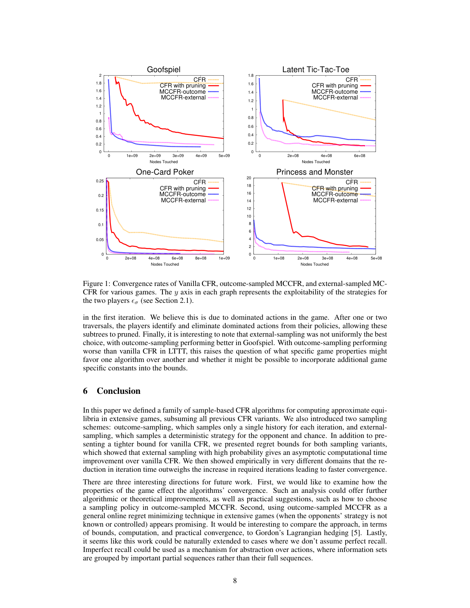
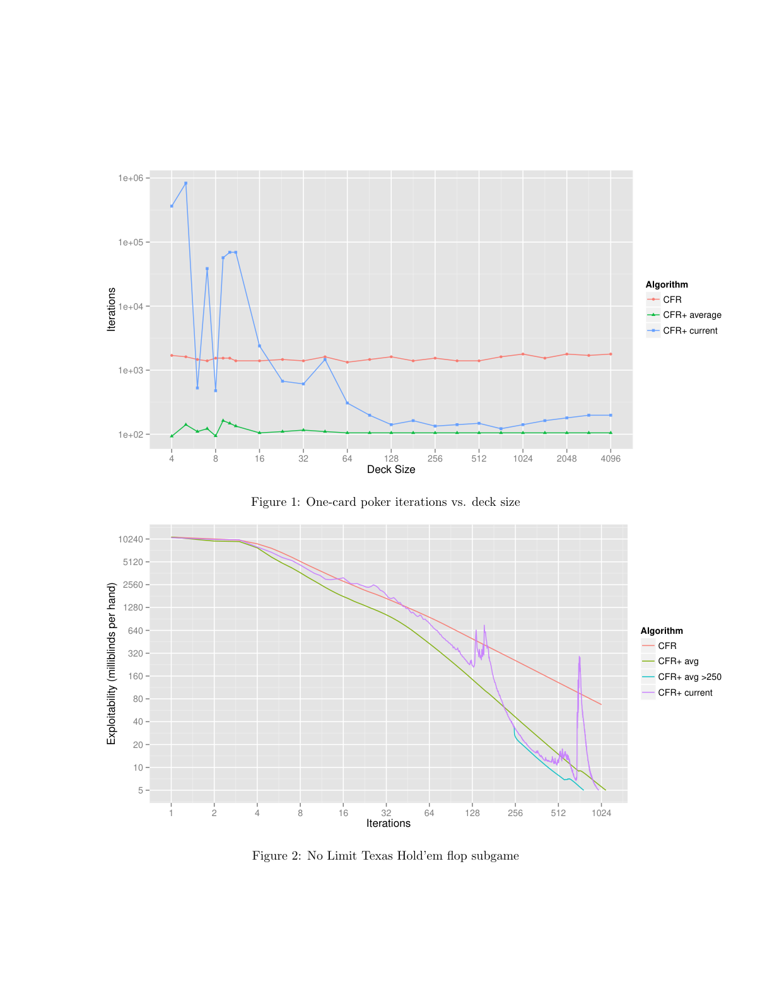
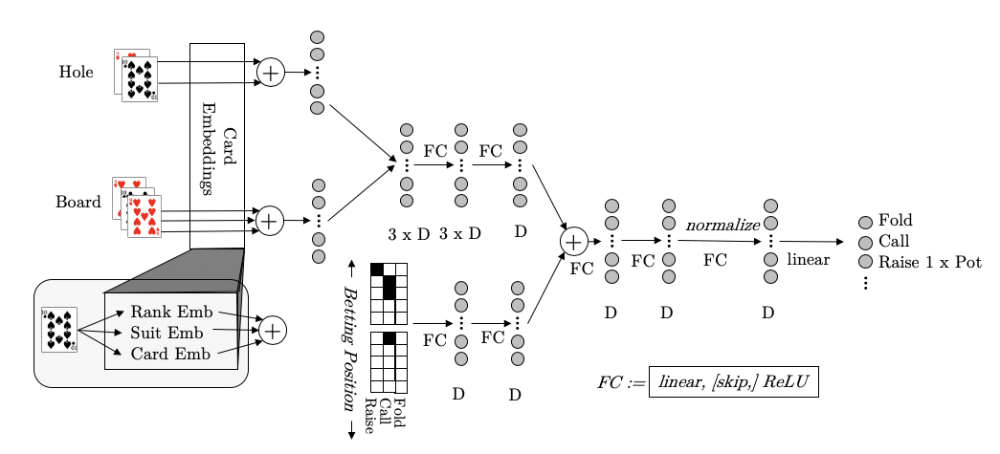
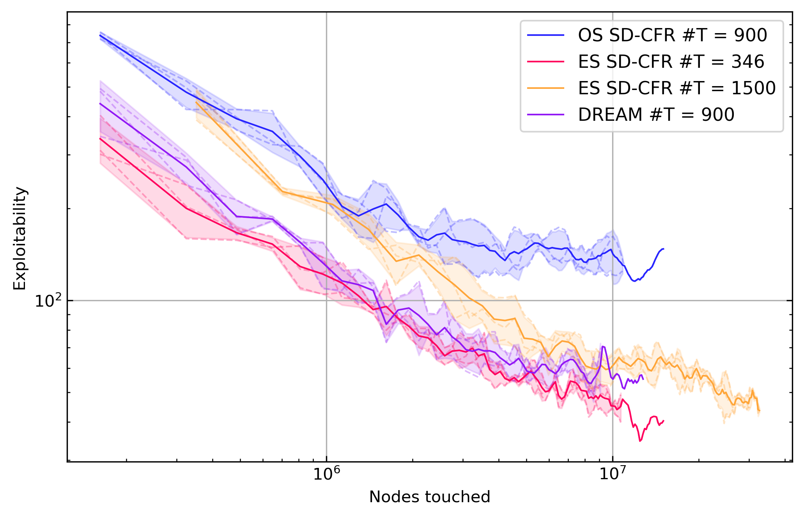

# DREAM in the CFR lineage: what it inherits, what it changes, and where it fits

This document places **DREAM** inside the exact line of work that runs from **vanilla CFR** through **MCCFR**, **CFR+ / LCFR / DCFR**, **Deep CFR**, and **Single Deep CFR (SD-CFR)**.

The goal is not just to summarize each paper, but to answer the more important question:

> **What parts of DREAM are inherited from earlier CFR papers, what parts are deliberately rejected, and what new piece does DREAM add?**

I also include short quotes from the original papers and a few extracted figures where they were cleanly recoverable.

---

## Executive summary

The shortest faithful lineage is:

1. **CFR (2007)** gives the core decomposition: regret minimization at each infoset, with convergence through the **average strategy**.
2. **MCCFR (2009)** makes CFR scalable by replacing full-tree traversals with **sampled traversals**.
3. **CFR+ (2014)** and later **LCFR / DCFR (2018/2019)** make tabular CFR much faster in practice.
4. **RCFR (2015)** is the early function-approximation precursor: estimate regrets with a model rather than a table.
5. **Deep CFR (2019)** turns the RCFR idea into a successful deep-learning method, but it still depends on a **perfect simulator** because it uses **external sampling**.
6. **SD-CFR (2019)** removes Deep CFR’s extra average-policy network and gets a cleaner approximation of linear CFR.
7. **DREAM (2020)** takes the neural CFR line and makes it **model-free** by switching from external sampling to **outcome sampling**, then compensates for the resulting variance with **learned baselines**.

The most important conceptual correction is this:

> **DREAM is not “Deep CFR but with a small tweak.”**  
> It is really a **model-free neural outcome-sampling CFR method** that borrows:
>
> - the **CFR objective**,
> - the **MCCFR sampling view**,
> - the **LCFR weighting scheme**,
> - the **neural regret approximation** from Deep CFR,
> - the **average-policy reconstruction trick** from SD-CFR,
> - and the **baseline-based variance reduction idea** from VR-MCCFR.

So the most accurate ancestry is:

`CFR -> MCCFR -> VR-MCCFR / RCFR / LCFR -> Deep CFR -> SD-CFR -> DREAM`

not simply:

`CFR -> CFR+ -> Deep CFR -> DREAM`

---

## Chronological map

| Year | Paper | Main contribution | What DREAM inherits from it |
|---|---|---|---|
| 2007 | **CFR** | Counterfactual regret decomposition; average strategy converges | Regret matching objective, infoset-local updates, average-policy target |
| 2009 | **MCCFR** | Sampling instead of full traversal; outcome/external sampling | Sample-based CFR; specifically **outcome sampling** |
| 2014 | **CFR+** | Regret-matching+, clipping negative regrets, faster tabular convergence | Mostly *not* inherited directly; DREAM is closer to LCFR/MC-CFR than to CFR+ |
| 2015 | **RCFR** | Function approximation for regret instead of full tables | “Neural regret estimator” idea in spirit |
| 2019 | **VR-MCCFR** | Baseline-corrected sampled values to cut variance | Learned action baselines are the key enabler of DREAM |
| 2019 | **DCFR / LCFR** | Discounting and linear weighting variants; faster practical convergence | DREAM uses **Linear CFR weighting** |
| 2019 | **Deep CFR** | Deep neural approximation of CFR in full game, no manual abstraction | Advantage/value network training; replay over sampled regrets |
| 2019 | **SD-CFR** | Remove average-policy network, use stored value networks directly | DREAM uses SD-CFR-style average-policy reconstruction |
| 2020 | **DREAM** | Model-free neural CFR with outcome sampling and learned baselines | Adds the missing “model-free” piece |

---

## 1) CFR (2007): the foundation

**Paper:** Martin Zinkevich, Michael Johanson, Michael Bowling, Carmelo Piccione,  
*Regret Minimization in Games with Incomplete Information*  
Source: https://poker.cs.ualberta.ca/publications/NIPS07-cfr.pdf

### What the paper actually introduced

CFR’s key move is to break the global regret problem into one regret minimizer per **information set**. Instead of optimizing one giant object over the full game tree, it maintains regrets for each infoset/action pair and updates the policy with **regret matching**.

A short quote from the paper:

> “introduce the notion of counterfactual regret”

That phrase is not cosmetic. It is the whole trick. The algorithm asks:

- at infoset $I$,
- if I had always taken action $a$ whenever I got there,
- how much better would I have done **counterfactually**?

The cumulative regret is then used to define the next policy.

### Core update

For player $i$, information set $I$, action $a$:

$$
R_i^T(I,a)=\sum_{t=1}^T r_i^t(I,a)
$$

and the next policy is set by regret matching:

$$
\sigma_i^{T+1}(I,a)=
\begin{cases}
\frac{R_i^{T,+}(I,a)}{\sum_{a'} R_i^{T,+}(I,a')} & \text{if } \sum_{a'}R_i^{T,+}(I,a')>0 \\
\frac{1}{|A(I)|} & \text{otherwise}
\end{cases}
$$

where $x^+=\max(x,0)$.

### Why it mattered

This paper established the basic solver design that dominated imperfect-information game solving for years:

- local regrets at infosets,
- self-play over iterations,
- output the **average strategy**, not the last iterate.

### Pros

- Clean theory.
- Exact tabular algorithm.
- The best starting point for understanding the rest of the literature.
- Average-strategy convergence gives a robust equilibrium-finding story.

### Cons

- Full-tree traversals are expensive.
- Regret tables get huge.
- In large domains, practical use usually needs abstraction, sampling, or both.

### What DREAM inherits from CFR

DREAM keeps the deepest CFR idea unchanged:

1. **The object being learned is still regret-like / advantage-like information at infosets.**
2. **Policies are still produced by regret matching.**
3. **The final target is still the average policy, not the final iterate.**

What DREAM does **not** keep is the full-tree tabular implementation.

---

## 2) MCCFR (2009): sample the tree instead of traversing all of it

**Paper:** Marc Lanctot, Kevin Waugh, Martin Zinkevich, Michael Bowling,  
*Monte Carlo Sampling for Regret Minimization in Extensive Games*  
Source: https://papers.neurips.cc/paper/3713-monte-carlo-sampling-for-regret-minimization-in-extensive-games.pdf

### What it added

MCCFR says: full traversals are too expensive, so sample only part of the tree on each iteration and preserve the CFR guarantees **in expectation**.

A short quote:

> “family of Monte Carlo CFR minimizing algorithms”

That family contains multiple sampling choices, but the two that matter here are:

- **External sampling (ES):** sample chance and opponent actions, but enumerate all actions for the traverser.
- **Outcome sampling (OS):** sample only a single trajectory.

### Why the distinction matters

This is the branch point that eventually separates **Deep CFR** from **DREAM**:

- **Deep CFR** uses **external sampling**, which assumes you can branch over all traverser actions. That is natural with a perfect simulator.
- **DREAM** uses **outcome sampling**, which only needs one sampled trajectory and is therefore compatible with **model-free** interaction.

### Figure from the MCCFR paper

*Figure source: page with Figure 1 from the original MCCFR paper.*

### Pros

- Much cheaper iterations than vanilla CFR.
- Opens the door to learning from sampled interaction.
- The key practical bridge from tabular CFR to scalable neural variants.

### Cons

- Sampling adds variance.
- Convergence can be noisier.
- The choice of sampling scheme matters a lot.

### What DREAM inherits from MCCFR

DREAM inherits the **sampled-CFR worldview** from MCCFR, and specifically:

- it is **not** doing full-tree tabular CFR;
- it is built on **outcome sampling**;
- it uses importance-weighted sampled targets because the traversal distribution differs from the true policy distribution.

This is one of the most important inheritance links in the whole lineage.

---

## 3) CFR+ (2014): the practical tabular speedup

**Paper:** Oskari Tammelin,  
*Solving Large Imperfect Information Games Using CFR+*  
Source: https://arxiv.org/abs/1407.5042

### What it changed

CFR+ modifies the regret minimizer used inside CFR. In practice the most visible change is that negative cumulative regrets are clipped at zero in the update process, producing **regret-matching+** behavior.

A short quote:

> “outperforms the previously known algorithms by an order of magnitude”

That is why CFR+ became so influential. It was not just theoretically interesting; it was operationally faster.

### Why it worked so well in practice

Vanilla regret matching can carry around large negative regret mass. CFR+ removes much of that burden. Combined with alternating updates and weighted averaging, this led to major practical gains.

### Figure from the CFR+ paper

*Figure source: page containing Figures 1 and 2 from the original CFR+ paper.*

### Pros

- Huge practical speedup over vanilla CFR in many tabular settings.
- Became the dominant practical tabular baseline.
- Important in real poker milestones.

### Cons

- Still tabular.
- Still needs large structured traversals and often abstraction.
- Its original proof story later needed correction under alternating updates.

### What DREAM inherits from CFR+

This point is easy to get wrong.

**DREAM does not inherit much directly from CFR+.**

DREAM is **not** the model-free neuralization of CFR+. Its direct line is closer to:

- sampled CFR,
- linear weighting,
- neural advantage approximation,
- SD-CFR’s average-policy reconstruction,
- baseline-reduced outcome sampling.

So CFR+ is important historically, but it is **not the main parent of DREAM**.

---

## 4) RCFR / functional regret estimation (2015): the missing precursor

**Paper:** Kevin Waugh, Dustin Morrill, J. Andrew Bagnell, Michael Bowling,  
*Solving Games with Functional Regret Estimation*  
Source: https://cdn.aaai.org/ojs/9445/9445-13-12973-1-2-20201228.pdf

### Why this paper matters more than it is usually given credit for

RCFR is the early paper that says: instead of a huge regret table, learn a **function approximator** that predicts regret.

A short quote:

> “estimate the regret for choosing a particular action”

That is the conceptual bridge to Deep CFR and DREAM.

### Main idea

Rather than store exact regrets per infoset/action, RCFR learns a model that predicts them from features. In other words:

- **tabular CFR:** regret values are memorized;
- **RCFR:** regret values are approximated.

### Pros

- First principled function-approximation CFR paper.
- Suggests that abstraction can be **learned** rather than hand-designed.
- Important conceptual ancestor of Deep CFR and DREAM.

### Cons

- Earlier function approximators and features were limited.
- Did not yet produce the large-game neural breakthrough.
- Not the same practical leap as Deep CFR.

### What DREAM inherits from RCFR

DREAM inherits RCFR’s central philosophical move:

> **regrets / advantages can be represented by a learned model rather than by a full table**

Deep CFR is the direct deep version of that idea; DREAM continues the same line.

---

## 5) VR-MCCFR (2019): the variance-reduction tool that DREAM actually needs

**Paper:** Martin Schmid, Neil Burch, Marc Lanctot, Matej Moravcik, Rudolf Kadlec, Michael Bowling,  
*Variance Reduction in Monte Carlo Counterfactual Regret Minimization (VR-MCCFR) for Extensive Form Games Using Baselines*  
Source: https://cdn.aaai.org/ojs/4048/4048-13-7107-1-10-20190704.pdf

### What it added

VR-MCCFR introduces baseline-corrected sampled values for MCCFR, analogous to control variates / baselines in policy gradient RL.

A short quote:

> “the variance of the value estimates can be reduced to zero”

That result is the direct technical motivation behind DREAM.

### Why this paper is central for DREAM

Outcome sampling is attractive because it is model-free friendly, but it has much higher variance than external sampling.

DREAM’s core problem is therefore:

- **How do you make outcome-sampling neural CFR stable enough to work?**

The answer DREAM adopts is:

- **use learned baselines to reduce variance**, inspired directly by VR-MCCFR.

### Pros

- A major variance reduction result.
- Makes sampled CFR much more practical.
- Conceptually unifies MCCFR with baseline ideas from RL.

### Cons

- In tabular form, it still assumes stronger access to game structure than DREAM can use.
- Perfect or near-perfect baselines are hard to get.
- Some baseline constructions rely on simulator access.

### What DREAM inherits from VR-MCCFR

This is the single most important direct inheritance beyond SD-CFR.

DREAM inherits:

1. **baseline-corrected sampled values**,  
2. **the idea that better baselines reduce variance without biasing the estimator**,  
3. **bootstrapped estimates along a sampled trajectory**, in spirit.

What DREAM does **not** inherit is the full perfect-simulator setting. The DREAM paper is explicit that it cannot use baselines for chance/environment actions the same way VR-MCCFR can, because that would require model access.

So DREAM’s main technical contribution is not “invent baselines.”  
It is:

> **take the baseline idea from VR-MCCFR and make it usable in a neural, model-free setting**

---

## 6) DCFR / LCFR (2018/2019): the weighting scheme behind Deep CFR and DREAM

**Paper:** Noam Brown, Tuomas Sandholm,  
*Solving Imperfect-Information Games via Discounted Regret Minimization*  
Source: https://arxiv.org/abs/1809.04040

### What it added

This paper introduces regret-discounting and weighting variants such as **LCFR** and **DCFR**.

A short quote:

> “discount regrets from earlier iterations”

and another useful line from the abstract is that one variant

> “outperforms CFR+, the prior state-of-the-art algorithm”

### Why this matters for Dream/Deep CFR

Deep CFR and DREAM are often loosely described as “deep CFR.” But the practical weighting they mimic is much closer to **Linear CFR** than to vanilla CFR.

Linear CFR weights later iterations more heavily. In practice, this often converges faster.

### Pros

- Strong tabular practical improvements.
- A more refined weighting scheme than vanilla CFR.
- Important because it tolerates approximation error better than some other faster CFR variants.

### Cons

- Still tabular when used directly.
- More moving parts than vanilla CFR.
- Can be glossed over even though it materially affects neural CFR implementations.

### What DREAM inherits from LCFR / DCFR

DREAM explicitly uses **Linear CFR weighting**. Concretely, it weights training samples by iteration number and also uses iteration-weighted model sampling when reconstructing the average policy.

That is a real inheritance link, not a side detail.

---

## 7) Deep CFR (2019): the first successful neural CFR at scale

**Paper:** Noam Brown, Adam Lerer, Sam Gross, Tuomas Sandholm,  
*Deep Counterfactual Regret Minimization*  
Source: https://proceedings.mlr.press/v97/brown19b/brown19b.pdf

### What it added

Deep CFR finally made the “learn regret with a model” idea work at large-game scale.

A short quote:

> “obviates the need for abstraction”

That is the headline. Instead of:
- hand-crafting an abstraction,
- solving the abstract game tabularly,
- mapping the result back,

Deep CFR learns directly in the full game with deep networks.

### How Deep CFR works

For one traverser at a time:

1. run **external-sampling** traversals,
2. collect sampled instantaneous regret targets,
3. store them in a replay buffer,
4. train an **advantage/value network** to predict them,
5. collect average-policy targets in a second buffer,
6. train a separate **average-strategy network** for the final policy.

### Important nuance

Deep CFR is not best understood as “deep CFR+”.  
It is much better understood as:

- **neural sampled CFR**
- with **LCFR-style weighting**
- and **external sampling**
- plus a separate network for the average strategy.

### Figure from the Deep CFR paper

The original Deep CFR network architecture is closely mirrored by the architecture later reused in DREAM. The DREAM appendix explicitly states it uses the architecture demonstrated to work in Deep CFR / NFSP, with small input adjustments.

### Pros

- First successful non-tabular CFR method in large games.
- Removes manual abstraction.
- Strong empirical performance.
- Clear neural approximation target: per-infoset advantages.

### Cons

- Requires a **perfect simulator** because it relies on **external sampling**.
- Has two approximation layers:
  - regret/advantage model,
  - average-policy model.
- The extra average-policy network can add error.

### What DREAM inherits from Deep CFR

DREAM inherits several major design choices:

1. **Use a neural network to predict infoset-action advantages/regrets.**
2. **Train from replay buffers of sampled regret-like targets.**
3. **Approximate tabular CFR behavior in the full game.**
4. **Reuse the same broad network style.**

But DREAM rejects one central dependency of Deep CFR:

> **Deep CFR needs a perfect simulator because it uses external sampling.**

That rejection is exactly why DREAM exists.

---

## 8) SD-CFR (2019): remove the average-policy network

**Paper:** Eric Steinberger,  
*Single Deep Counterfactual Regret Minimization*  
Source: https://arxiv.org/abs/1901.07621

### What it changed

SD-CFR keeps Deep CFR’s value-network learning, but removes the separate average-policy network.

A short quote:

> “lower overall approximation error”

The reason is simple. Deep CFR approximates twice:

1. learn advantages,
2. learn the average policy induced by those advantages.

SD-CFR says the second approximation is unnecessary.

### Main idea

Store the value / advantage model from each iteration. At evaluation time, sample one iteration model according to the appropriate weighting and use that policy through the whole game. This reproduces the CFR average-policy mixture much more faithfully.

### Pros

- Simpler than Deep CFR.
- Removes one major source of approximation error.
- Better theoretical approximation of linear CFR when all value nets are stored.
- Often better empirical convergence.

### Cons

- Must store many iteration models.
- Still depends on value-network quality.
- Still depends on the sampling scheme used to generate the regret targets.

### What DREAM inherits from SD-CFR

DREAM explicitly follows the **SD-CFR way of reconstructing the average policy**.

This matters a lot. DREAM is not just “Deep CFR made model-free.”  
It is more precisely:

- **SD-CFR-style average-policy reconstruction**
- on top of
- **outcome-sampled neural CFR**
- with **learned baselines**.

That is why a better shorthand for DREAM is something like:

> **baseline-reduced, model-free, outcome-sampling SD-CFR**

rather than “Deep CFR with baselines.”

---

## 9) DREAM (2020): the model-free neural CFR variant

**Paper:** Eric Steinberger, Adam Lerer, Noam Brown,  
*DREAM: Deep Regret Minimization with Advantage Baselines and Model-free Learning*  
Source: https://arxiv.org/abs/2006.10410  
Ar5iv HTML used for readable figures/text: https://ar5iv.labs.arxiv.org/html/2006.10410

### The problem DREAM is trying to solve

Deep CFR and SD-CFR work well, but they rely on **external sampling**, which in practice means a **perfect simulator** of the game.

DREAM wants to remove that requirement.

A short quote from the abstract:

> “does not require access to a perfect simulator”

That is the whole point of the paper.

### DREAM’s key move

DREAM changes the sampling regime from **external sampling** to **outcome sampling** so that training only needs sampled trajectories, i.e. a model-free interaction stream.

But outcome sampling alone performs poorly in the neural setting because its variance is high. So DREAM adds:

- a **learned Q-baseline / history-action baseline**,
- trained from experience,
- to reduce the variance of outcome-sampled regret targets.

This is the decisive innovation.

### Another short quote from the paper

> “samples only a single action at each decision point”

That is what makes it model-free friendly.

### What DREAM keeps

From earlier papers, DREAM keeps all of the following:

- **CFR:** regret matching and average-policy convergence target.
- **MCCFR:** sampled traversals.
- **LCFR:** linear iteration weighting.
- **RCFR / Deep CFR:** learn advantages with a neural model.
- **SD-CFR:** reconstruct the average policy by storing iteration models.
- **VR-MCCFR:** use baselines to reduce variance.

### What DREAM changes

Compared to Deep CFR / SD-CFR, DREAM changes three core things:

1. **Sampling**
   - Deep CFR / SD-CFR: external sampling
   - DREAM: outcome sampling with exploration

2. **Variance control**
   - Deep CFR / SD-CFR: rely on lower-variance external sampling and perfect simulation
   - DREAM: add learned baselines to make high-variance outcome sampling usable

3. **Model assumptions**
   - Deep CFR / SD-CFR: need a simulator to branch over actions
   - DREAM: works from sampled trajectories, i.e. **model-free**

### Figure: DREAM architecture

*Figure source: DREAM appendix architecture figure. The paper notes this architecture is the same basic style that worked in Deep CFR / NFSP, with adjusted inputs for DREAM.*

### Figure: DREAM vs OS-SD-CFR / ES-SD-CFR in Leduc

*Figure source: comparison figure from the DREAM paper. It visually captures the main point: raw outcome-sampling SD-CFR performs poorly, and the baseline-equipped DREAM version repairs much of that gap.*

### How DREAM works, step by step

For one player at a time (alternating CFR iterations):

1. **Policy from current advantage network**
   - Input the current infoset to an advantage network.
   - Convert predicted advantages into a policy with regret matching.

2. **Outcome-sampling traversal**
   - Sample a single trajectory through the game.
   - Use exploration in the traverser’s sampling policy.

3. **Baseline-adjusted sampled value**
   - Use a learned baseline network to reduce the variance of action-value estimates along the sampled path.

4. **Store advantage targets**
   - Insert the baseline-adjusted sampled advantages into an advantage replay buffer.

5. **Train the advantage network**
   - Fit the advantage network to those targets.
   - Weight the loss by iteration number to mimic **Linear CFR**.

6. **Average-policy reconstruction**
   - Store one advantage model per iteration, as in SD-CFR.
   - At test time, sample one model according to its LCFR weight and use it throughout the episode.

### Why this is a genuine addition, not a simple tweak

DREAM adds a capability the previous neural CFR papers did not have:

> **good performance without a perfect simulator**

That sounds modest, but it changes the deployment setting completely.

Deep CFR and SD-CFR are natural if you can:
- enumerate legal actions,
- branch hypothetical traverser actions,
- and query the simulator repeatedly.

DREAM is meant for the harder setting where you only get sampled transitions.

### The theoretical position of DREAM

The paper states that DREAM:

- converges to a **Nash equilibrium** in two-player zero-sum games,
- and to an **extensive-form coarse correlated equilibrium** in more general settings.

That makes DREAM broader in principle than a poker-only engineering story. It is a general regret-based multi-agent RL method for imperfect information.

### DREAM’s strengths

1. **Model-free**
   - This is the headline strength.

2. **No manual abstraction**
   - Same broad benefit as Deep CFR.

3. **Better than raw outcome-sampling neural CFR**
   - The baseline machinery is not optional decoration; it is the piece that makes model-free neural CFR practical.

4. **Uses SD-CFR’s cleaner average-policy construction**
   - Avoids Deep CFR’s extra average-policy approximation.

5. **Strong empirical performance among model-free methods**
   - The paper reports state-of-the-art model-free results in benchmark poker domains.

### DREAM’s weaknesses

1. **Still higher variance than simulator-based external sampling methods**
   - Baselines help, but they do not make outcome sampling magically easy.

2. **Baseline quality matters**
   - Poor baselines mean poor variance reduction.

3. **Only player-action baselines**
   - The paper explicitly notes that chance/environment-action baselines would require stronger model access.

4. **Still stores iteration models like SD-CFR**
   - Better approximation, but more storage/logistics.

5. **Not obviously better than simulator-based methods when a perfect simulator is available**
   - DREAM’s value is strongest exactly when such a simulator is *not* available.

---

## Precisely what DREAM inherits, paper by paper

This is the high-value summary.

### From CFR (2007)
DREAM inherits:
- infoset-local regret minimization,
- regret matching,
- average-policy equilibrium target.

DREAM discards:
- full-tree tabular updates.

### From MCCFR (2009)
DREAM inherits:
- sample-based CFR,
- importance-weighted sampled targets,
- specifically **outcome sampling**.

DREAM discards:
- the assumption that external sampling is the default route.

### From CFR+ (2014)
DREAM inherits:
- mainly the broader lesson that faster CFR variants matter in practice.

DREAM does **not** directly inherit:
- regret-matching+ as its defining update,
- the core CFR+ identity.

### From RCFR (2015)
DREAM inherits:
- the idea that regret can be approximated by a learned function.

DREAM upgrades:
- from classic regressors/features to deep neural networks and replay-based training.

### From VR-MCCFR (2019)
DREAM inherits:
- baseline-corrected sampled values,
- unbiased variance reduction logic,
- the importance of action-dependent baselines.

DREAM modifies:
- replaces tabular / simulator-heavy baselines with **learned neural baselines** that only require sampled interaction.

### From LCFR / DCFR (2019)
DREAM inherits:
- **linear weighting** of training targets / losses,
- and weighted average-policy reconstruction.

### From Deep CFR (2019)
DREAM inherits:
- advantage-network training,
- replay over sampled regret targets,
- full-game neural approximation without manual abstraction,
- similar network architecture.

DREAM discards:
- the need for **external sampling**,
- and therefore the need for a **perfect simulator**.

### From SD-CFR (2019)
DREAM inherits:
- no separate average-policy network,
- store iteration value/advantage models,
- reconstruct the average policy from the stored models.

DREAM modifies:
- the underlying sampled targets are now outcome-sampled and baseline-corrected.

---

## The single best mental model for DREAM

If you want one sentence that captures it accurately, use this:

> **DREAM is SD-CFR-style neural CFR trained from outcome-sampled trajectories, made practical by learned baselines, and weighted like LCFR.**

That sentence is much more accurate than:

> “DREAM is Deep CFR but model-free”

because it highlights all the actual parent ideas:

- **SD-CFR** for average-policy handling,
- **MCCFR outcome sampling** for model-free data,
- **VR-MCCFR** for variance reduction,
- **LCFR** for weighting.

---

## Method-by-method pros and cons, compact comparison

| Method | Main strength | Main weakness | Why it matters for DREAM |
|---|---|---|---|
| CFR | Clean theoretical base | Full traversals, huge tables | DREAM keeps its objective |
| MCCFR | Cheap sampled iterations | High variance | DREAM uses its sampling view |
| CFR+ | Fast tabular convergence | Still tabular; not model-free | Historical context, not main ancestor |
| RCFR | First regret function approximation | Earlier, smaller-scale approximators | Conceptual precursor |
| VR-MCCFR | Strong variance reduction | Often assumes more model structure | DREAM’s key technical inspiration |
| LCFR / DCFR | Faster practical convergence | Still tabular directly | DREAM uses LCFR weighting |
| Deep CFR | First successful neural CFR | Needs perfect simulator; average-network error | Direct neural ancestor |
| SD-CFR | Cleaner average-policy approximation | Stores many models | DREAM inherits this directly |
| DREAM | Model-free neural CFR with baselines | Higher variance than ES methods; baseline quality matters | Final method of interest |

---

## A subtle but important point: DREAM is not anti-Deep CFR

DREAM does **not** replace Deep CFR in every setting.

If you have a strong simulator and can afford external sampling, Deep CFR / SD-CFR may still be preferable because they enjoy lower variance.

DREAM is best understood as solving a different problem:

- **Deep CFR / SD-CFR:** best when simulator access is available
- **DREAM:** best when you need **model-free** learning from sampled interaction

That distinction is the cleanest way to understand the paper.

---

## What I would say in one paragraph if asked in a paper review

CFR gave the fundamental regret-decomposition view. MCCFR made that view sample-based. RCFR introduced the idea of approximating regrets with a learned function. CFR+ and LCFR/DCFR showed that the exact regret-updating rule and weighting scheme matter hugely in practice. Deep CFR made neural regret approximation work at scale, but depended on external sampling and a perfect simulator. SD-CFR then removed the extra average-policy network, making the approximation cleaner. DREAM takes that neural CFR line into the model-free regime by replacing external sampling with outcome sampling and then importing the baseline idea from VR-MCCFR to control the variance explosion that outcome sampling would otherwise cause.

---

## Selected short quotes from the original papers

These are short on purpose; I am quoting only small fragments.

- **CFR (2007):** “introduce the notion of counterfactual regret”
- **MCCFR (2009):** “family of Monte Carlo CFR minimizing algorithms”
- **CFR+ (2014):** “outperforms the previously known algorithms by an order of magnitude”
- **RCFR (2015):** “estimate the regret for choosing a particular action”
- **DCFR / LCFR (2019):** “discount regrets from earlier iterations”
- **Deep CFR (2019):** “obviates the need for abstraction”
- **SD-CFR (2019):** “lower overall approximation error”
- **VR-MCCFR (2019):** “variance of the value estimates can be reduced to zero”
- **DREAM (2020):** “does not require access to a perfect simulator”

---

## References

### Core CFR lineage
1. Zinkevich, Johanson, Bowling, Piccione (2007). *Regret Minimization in Games with Incomplete Information*.  
   https://poker.cs.ualberta.ca/publications/NIPS07-cfr.pdf

2. Lanctot, Waugh, Zinkevich, Bowling (2009). *Monte Carlo Sampling for Regret Minimization in Extensive Games*.  
   https://papers.neurips.cc/paper/3713-monte-carlo-sampling-for-regret-minimization-in-extensive-games.pdf

3. Tammelin (2014). *Solving Large Imperfect Information Games Using CFR+*.  
   https://arxiv.org/abs/1407.5042

4. Waugh, Morrill, Bagnell, Bowling (2015). *Solving Games with Functional Regret Estimation*.  
   https://cdn.aaai.org/ojs/9445/9445-13-12973-1-2-20201228.pdf

5. Schmid, Burch, Lanctot, Moravcik, Kadlec, Bowling (2019). *Variance Reduction in Monte Carlo Counterfactual Regret Minimization (VR-MCCFR) for Extensive Form Games Using Baselines*.  
   https://cdn.aaai.org/ojs/4048/4048-13-7107-1-10-20190704.pdf

6. Brown, Sandholm (2019). *Solving Imperfect-Information Games via Discounted Regret Minimization*.  
   https://arxiv.org/abs/1809.04040

7. Brown, Lerer, Gross, Sandholm (2019). *Deep Counterfactual Regret Minimization*.  
   https://proceedings.mlr.press/v97/brown19b/brown19b.pdf

8. Steinberger (2019). *Single Deep Counterfactual Regret Minimization*.  
   https://arxiv.org/abs/1901.07621

9. Steinberger, Lerer, Brown (2020). *DREAM: Deep Regret Minimization with Advantage Baselines and Model-free Learning*.  
   https://arxiv.org/abs/2006.10410  
   Readable HTML and extractable figures: https://ar5iv.labs.arxiv.org/html/2006.10410

### Useful theory cleanup / context
10. Burch, Moravcik, Schmid (2019). *Revisiting CFR+ and Alternating Updates*.  
    https://arxiv.org/abs/1810.11542

---

## Notes on the illustrations in this markdown

I included figures that were straightforward to recover cleanly from the original sources. The most useful ones for understanding DREAM are:

- the **MCCFR convergence plot**,
- the **CFR+ speedup plots**,
- the **DREAM architecture**, and
- the **DREAM comparison figure** showing why raw outcome-sampling SD-CFR is not enough.

For some papers, the PDF page extraction is less clean than the ar5iv-hosted DREAM figures, so the image set here is selective rather than exhaustive.
